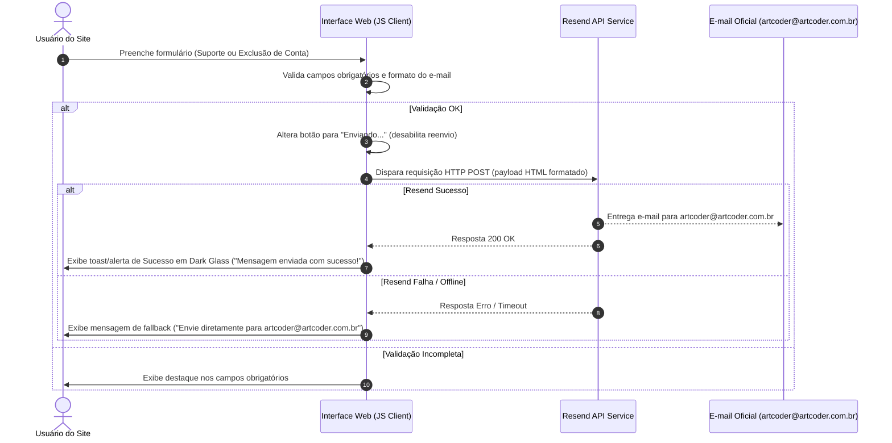

# Especificação de Design: Landing Page & Compliance Artcoder Sistemas e Tecnologia

**Data:** 2026-08-11  
**Status:** Aprovado  
**Autor:** Artcoder / AI Pair Programmer  

---

## 1. Visão Geral do Projeto

A **Artcoder Sistemas e Tecnologia** necessita de um site corporativo / landing page de alta performance com duas finalidades principais:
1. **Presença Institucional & Portfólio:** Apresentar a empresa como especialista em engenharia de software, microsserviços, nuvem e desenvolvimento mobile (destacando o produto **AirsoftHub**).
2. **Conformidade Legal para Lojas (Google Play Store & Apple App Store):** Disponibilizar URLs dedicadas e acessíveis publicamente para **Política de Privacidade**, **Termos de Uso** e **Solicitação de Exclusão de Conta e Dados** (requisito obrigatório para publicação e aprovação de apps nas lojas).

---

## 2. Identidade Visual & Design System

### 2.1 Paleta de Cores (Dark Mode + Laranja Accent)
* **Fundo Principal (`--bg-main`):** `#0F172A` (Slate Dark / Grafite Escuro)
* **Containers / Cards (`--bg-card`):** `#1E293B` (Grafite Médio para profundidade)
* **Hover de Cards (`--bg-card-hover`):** `#26354A`
* **Laranja Principal (`--primary-orange`):** `#FF6B00` (Ação / Energia - Botões e Destaques)
* **Laranja Secundário (`--secondary-orange`):** `#FFA048` (Hover e detalhes de suave contraste)
* **Texto Principal (`--text-primary`):** `#F8FAFC` (Branco Gelo para leitura confortável)
* **Texto Secundário (`--text-secondary`):** `#94A3B8` (Cinza Claro para subtítulos e rodapés)
* **Bordas & Vidro (`--border-color`):** `rgba(255, 255, 255, 0.08)` (efeito Glassmorphism)

### 2.2 Tipografia & Elementos Visuais
* **Fonte:** Google Fonts (*Inter* ou *Outfit*).
* **Efeitos:** Dark Glassmorphism em headers/navbars (`backdrop-filter: blur(12px)`), iluminação radial suave em gradiente laranja no fundo da Hero section, transições suaves (`transition: all 0.3s ease`) em botões e cards.

---

## 3. Arquitetura de Arquivos

```
artcoder-lp/
├── index.html              # Landing Page Principal
├── privacidade.html        # Política de Privacidade (LGPD & App Store compliant)
├── termos.html            # Termos de Uso
├── exclusao-de-conta.html  # Solicitação de Exclusão de Conta e Dados
├── assets/
│   ├── css/
│   │   └── style.css       # Design System, layout, responsividade e animações
│   ├── js/
│   │   └── main.js         # Lógica do menu, formulários e integração Resend API
│   └── images/
│       ├── logo.svg        # Logo ARTCODER </>
│       ├── airsofthub-app.png # Mockup / Badge do produto AirsoftHub
│       └── favicon.ico     # Favicon corporativo
└── docs/
    └── superpowers/
        └── specs/
            └── 2026-08-11-artcoder-lp-design.md
```

---

## 4. Detalhamento de Telas e Conteúdo

### 4.1 `index.html` (Landing Page Principal)
* **[HEADER]**
  * Logo: `ARTCODER </>` (destaque alaranjado em `</>`)
  * Menu Sticky: Sobre (`#sobre`) | Produtos (`#produtos`) | Suporte (`#suporte`) | Legal (`#legal`)
  * Menu hambúrguer responsivo para telas móveis.
* **[HERO SECTION]**
  * Título: *Engenharia de Software e Soluções Digitais de Alta Performance*
  * Subtítulo: *Construímos plataformas escaláveis, APIs robustas e experiências mobile intuitivas. Do conceito ao deploy.*
  * CTA Primário: `[ Conheça Nossos Produtos ]` (Scroll para `#produtos`)
  * CTA Secundário: `[ Falar com Suporte ]` (Scroll para `#suporte`)
* **[SEÇÃO 1: SOBRE A ARTCODER (`#sobre`)]**
  * Título: *Especialistas em Arquitetura & Desenvolvimento*
  * Texto Institucional: Foco na criação e manutenção de produtos digitais de alta disponibilidade, infraestruturas cloud, microsserviços e apps orientados à performance e geolocalização.
  * Cards técnicos: Cloud Infrastructure | Microsserviços APIs | Mobile Apps | Geolocalização & Real-time.
* **[SEÇÃO 2: NOSSOS PRODUTOS (`#produtos`)]**
  * Título: *Soluções em Destaque*
  * Card do **AirsoftHub**:
    * Tag: `Mobile App (iOS / Android)`
    * Descrição: *Plataforma de gestão de comunidades, agendamento de partidas e descoberta de campos de Airsoft com busca por geolocalização.*
    * Botão: `[ Visitar airsofthub.app ➔ ]`
    * Badges da App Store & Google Play Store.
* **[SEÇÃO 3: SUPORTE TÉCNICO & CONTATO (`#suporte`)]**
  * Título: *Canal de Atendimento e Suporte*
  * Informações: E-mail `artcoder@artcoder.com.br` | SLA: *Até 24 horas úteis*.
  * Formulário Interativo: Nome, E-mail, Assunto, Mensagem + Botão Enviar com feedback visual em tempo real.
* **[RODAPÉ (FOOTER JURÍDICO - `#legal`)]**
  * Dados Oficiais: `ARTCODER SISTEMAS E TECNOLOGIA | Curitiba - PR, Brasil`
  * Contato: `artcoder@artcoder.com.br`
  * Links Legais:
    * `[ Política de Privacidade ]` (`privacidade.html`)
    * `[ Termos de Uso ]` (`termos.html`)
    * `[ Exclusão de Conta e Dados ]` (`exclusao-de-conta.html`)
  * Copyright: `© 2026 Artcoder Sistemas e Tecnologia. Todos os direitos reservados.`

### 4.2 `privacidade.html` (Política de Privacidade)
* Cabeçalho simplificado com logo e link `← Voltar para o Início`.
* Cláusulas completas exigidas por LGPD, Google Play Data Safety e Apple App Store Guidelines:
  1. Coleta de dados (cadastrais, geolocalização no AirsoftHub, dados técnicos).
  2. Finalidade e uso das informações.
  3. Criptografia, armazenamento e segurança.
  4. Direitos do titular dos dados e link para solicitação de exclusão.
  5. Contato do Encarregado de Dados (`artcoder@artcoder.com.br`).

### 4.3 `termos.html` (Termos de Uso)
* Cláusulas contratuais de uso das plataformas digitais da Artcoder:
  1. Aceitação e elegibilidade.
  2. Licença de uso dos aplicativos e propriedade intelectual.
  3. Responsabilidade do usuário.
  4. Limitação de responsabilidade e Foro de Curitiba/PR.

### 4.4 `exclusao-de-conta.html` (Solicitação de Exclusão de Conta e Dados)
* Requisito obrigatório Google Play & Apple App Store.
* Explicação clara de quais dados são removidos e prazos de atendimento.
* Formulário de solicitação:
  * Nome completo, E-mail cadastrado, Seleção do Aplicativo (AirsoftHub / Outros), Checkbox de confirmação de exclusão irreversível.
  * Envio via Resend API com marcação prioritária.

---

## 5. Fluxo de Dados & Envio via Resend API



---

## 6. Critérios de Aceite & Verificação

1. **Compliance das Lojas:** As URLs `/privacidade.html`, `/termos.html` e `/exclusao-de-conta.html` estão ativas e acessíveis via navegação direta.
2. **Design & Responsividade:** O site renderiza perfeitamente com a paleta oficial em telas de 360px a 1920px+, sem overflow horizontal.
3. **Formulários Interativos:** Os formulários de suporte e exclusão validam dados e utilizam a Resend API com feedback visual claro.
4. **Performance & SEO:** Código HTML5 semântico com metatags OpenGraph ativas e alto índice de performance no Google Lighthouse.
